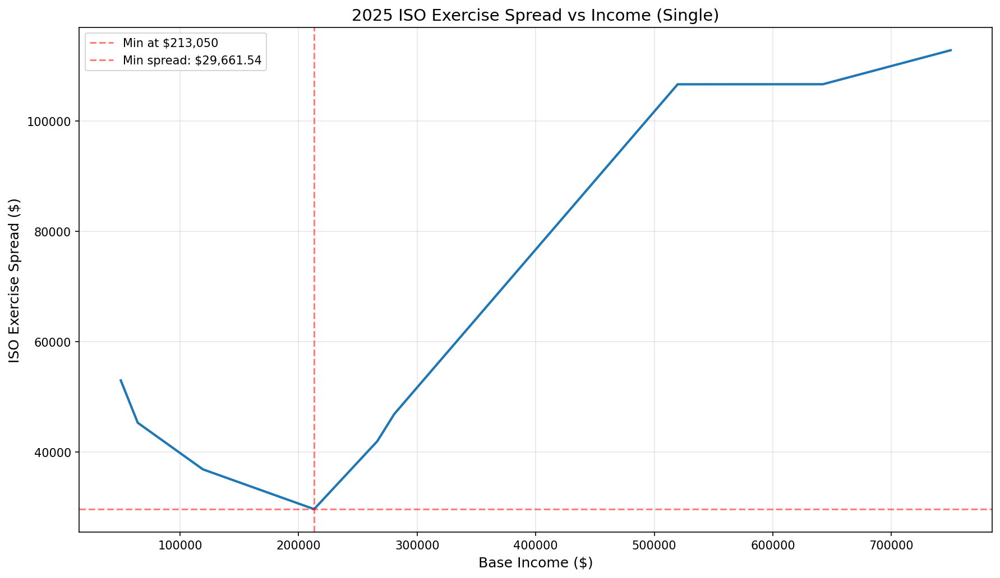

# ISO Exercise Tax Calculator

Calculate optimal Incentive Stock Option (ISO) exercise amounts by comparing ordinary income tax vs. Alternative Minimum Tax (AMT).

## Disclaimer

**This tool is for educational and informational purposes only. It is NOT tax, legal, or financial advice. Tax laws are complex and individual circumstances vary significantly. Always consult with a qualified tax professional or financial advisor before making any decisions about exercising stock options or other financial matters.**

## Quick Start

```bash
# Calculate for a single income
uv run iso_analysis.py 150000

# Plot spread over income range (saves to PNG file)
uv run iso_analysis.py 100000 500000
# Output: iso_spread_2025_Single_100000-500000.png
```

**Example output:**
```
Income:          $150,000.00
Ordinary tax:    $25,067.00    ← Tax under normal rules
AMT:             $16,094.00    ← Tax under AMT rules
ISO spread:      $34,511.54    ← Dollar amount of ISO bargain element where AMT = ordinary
```

## Understanding the Spread

The "spread" is the **dollar amount of ISO bargain element** where your AMT equals your current ordinary tax. Mathematically:

```
AMT(base_income + ISO_exercise) = Ordinary_tax(base_income)
```

This is the **crossover point** - the maximum ISO exercise without AMT exceeding ordinary tax.

**This is "optimal" ONLY IF your goal is to:**
- Maximize ISO exercise without paying more tax than you currently do
- Avoid triggering AMT (i.e., AMT exceeding ordinary tax)

**What happens at different exercise levels:**
- **Below the spread**: You pay ordinary tax, AMT is lower
- **At the spread**: AMT equals ordinary tax (no additional tax)
- **Above the spread**: AMT exceeds ordinary tax - you pay MORE

### Converting Spread to Shares

```
Shares to Exercise = Spread ÷ (FMV - Strike Price)
```

**Example:**
```
ISO spread:        $34,511.54
FMV:              $100.00/share
Strike price:     $10.00/share
Bargain element:  $90.00/share  ($100 - $10)

Shares to exercise = $34,511 ÷ $90 = 383 shares
```

**Note:** The "bargain element" is (FMV - strike), which becomes AMT income.

## Example Workflow

**Scenario**: $150k income, ISOs with $10 strike, $100 FMV

```bash
# Step 1: Find your optimal spread
uv run iso_analysis.py 150000
# Output: ISO spread: $34,511.54

# Step 2: Convert to shares (bargain element = $100 - $10 = $90)
# Shares to exercise = $34,511 / $90 = 383 shares

# Step 3: Visualize across income range
uv run iso_analysis.py 150000 650000
# Saves plot to: iso_spread_2025_Single_150000-650000.png
```

**Decision**:
- Exercise 383 shares to stay at the AMT/ordinary tax crossover
- Exercise cost: 383 × $10 = $3,830
- AMT income: 383 × $90 = $34,470
- Tax impact: No additional tax (AMT = ordinary)
- Exercising MORE pushes into higher AMT territory
- Exercising LESS leaves potential on the table

## Visualization

Comprehensive plot showing how optimal ISO exercise spread varies across income levels for Single filers in 2025:



**Key Insights:**
- Income range: $50,000 to $750,000
- Minimum spread ($29,661.54) occurs at $213,050 income
- Lower incomes allow more ISO exercise without triggering AMT
- Curve shows behavior through AMT exemption phaseout zone (starts at $626,350)

## Updating for New Tax Year

1. Open `iso_analysis.py`
2. Find: `UPDATE THESE SCHEDULES EACH YEAR`
3. Update values from IRS publications:

**Ordinary Tax Schedule** (from IRS Publication 17):
```python
ORDINARY_SCHEDULE = TaxSchedule(
    year=2026,
    filing_status="Single",
    exemption=Exemption(base_amount=16200),  # Standard deduction
    brackets=[...],  # Tax brackets from IRS tables
)
```

**AMT Schedule** (from IRS Form 6251):
```python
AMT_SCHEDULE = TaxSchedule(
    year=2026,
    filing_status="Single",
    exemption=Exemption(
        base_amount=90500,      # AMT exemption
        phaseout_start=640000,  # Phaseout threshold
        phaseout_rate=0.25,
    ),
    brackets=[...],  # AMT brackets (usually 26% and 28%)
)
```

4. Test: `uv run iso_analysis.py 150000`
